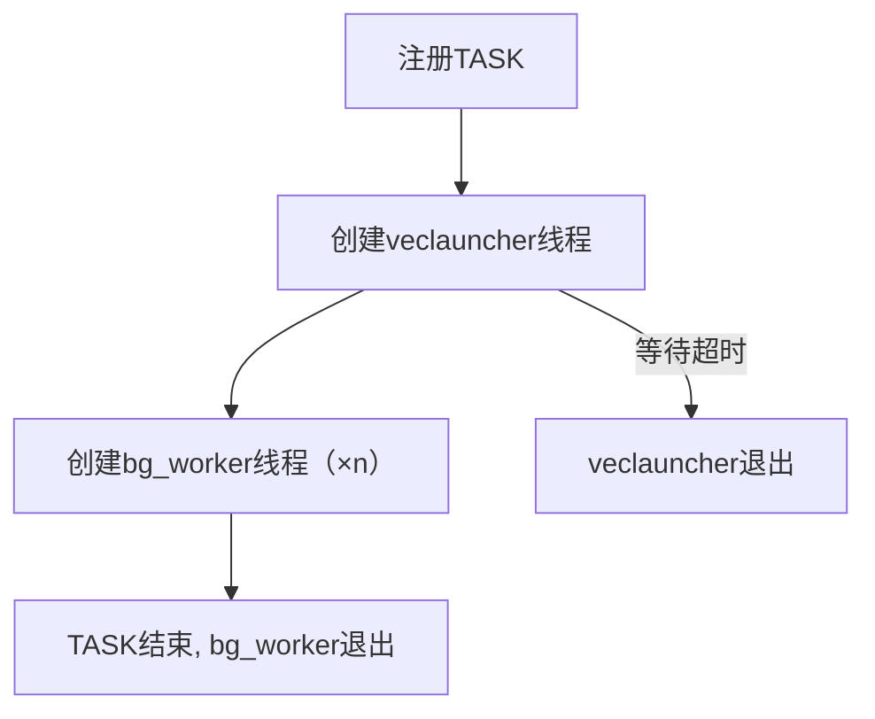
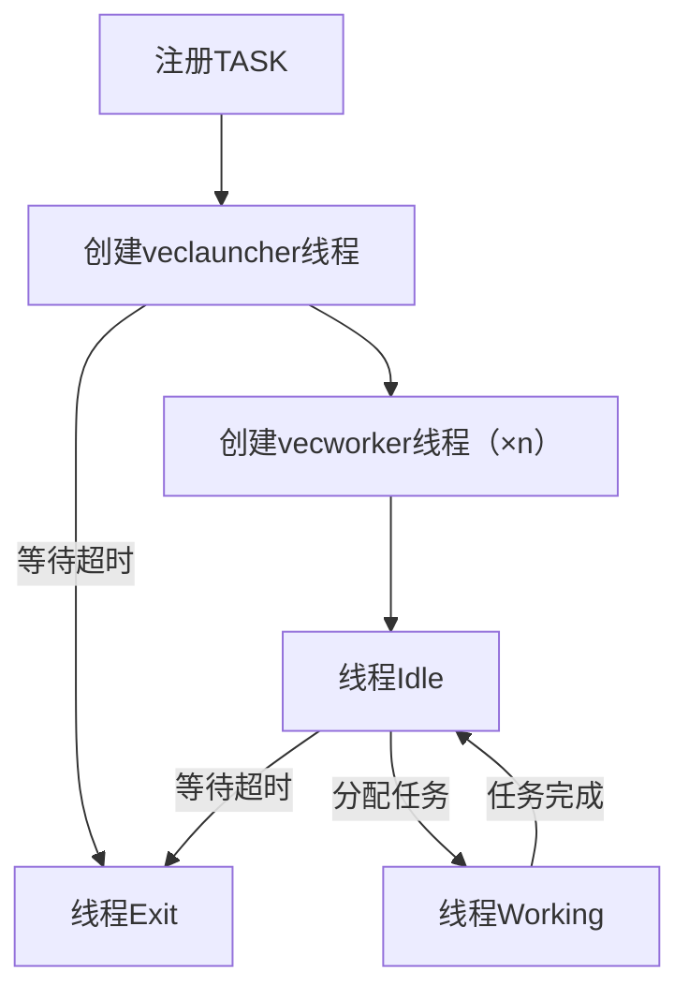

# 多线程任务框架
## 需求说明
在向量索引中，存在不少可以并行执行的任务，故需要一个多线程任务框架，以提供简单接口的方式支持多线程任务执行。目前适配的任务均为查询任务，故当前也可理解为多线程查询。
### 原始架构
原多线程任务架构调用了了内核的bg_worker线程接口，创建bg_worker线程来并行完成任务。

该架构有以下问题：
1. bg_worker默认情况下是建立索引专用的（当然具体执行的任务代码是我们写的）
2. bg_worker数量有上限
3. bg_worker任务完成后马上退出，当有新任务到来时需要重新创建

### 改进架构

### 当前架构
原始架构仍保留，并行创建索引时仍使用原来的方法，使用bg_worker；执行非索引创建的并行任务时使用vecworker。当前架构对比原架构有以下改进：
1. 将建立索引专用线程bg_worker与其他任务线程vecworker区分
2. vecworker的数量上限与bg_worker的数量上限不关联
3. vecworker线程复用，完成任务后不立刻退出，可以进入Idle状态等待接收新任务，在高并发场景下可以节省大量的线程创建与销毁时间。

改进架构用于非索引创建的可并行任务，目前已适配的有：
1. ivf查询
2. hybrid查询

## 代码修改
主要代码修改在taskpool.h/cpp, index_manager.cpp中。
### 原始设计
原始设计中，taskpool中为创建bg_worker多线程创建索引的逻辑。index_manager为创建单个worker线程维护hybrid索引的逻辑。二者无关联。
### 当前设计
- 前端：需要申请多线程完成任务的代码部分，如ivf scan, hybrid scan或后续其他代码处。
- 后端：负责vecworker线程的唤醒、分配以及维护等工作。
#### taskpool
1. taskpool中创建bg_worker多线程创建索引的逻辑仍保留且不修改。
2. taskpool作为`前端申请任务的接口`, 添加vecworker多线程任务**申请接口`LOAD_CONSUMER`**，前端通过`LOAD_CONSUMER`申请若干个vecworker，并通过 `RUN_TASK`传入任务。
#### index_manager
1. index_manager中维护hybrid的逻辑仍保留且不修改。
2. index_manager作为`后端`，添加vecworker的后端管理逻辑逻辑，包括唤醒、根据当前可用vecworker数量和任务数量分配vecworker、给vecworker分配具体任务等逻辑。

## 测试说明
主要关注性能测试，功能测试正确即可。

当前最大vecworker数量由guc参数`max_vector_indexer_query_threads`决定。

性能测试的结果可能并不稳定，但相比单线程至少不会降低，最低时与单线程持平。需要关注的因素有：
1. 一个vecworker在执行了某个database中的任务后，会**绑定**在该database，不能执行其他database的任务。例如，当全部vecworker先前分配到了d1执行任务，此时提交一个d2的任务，则没有vecworker能够执行。需要等待vecworker超时退出(20s)并重新创建后，才能绑定其他的database。
2. 可能会发生cpu利用率低于分配的线程数量，比如cpu利用率400%左右，而分配了8个vecworker。该情况正常，由任务本身特点决定。
3. 如果需要观察日志，需要打开`taskpool.h`中的`OUTPUT_TASKPOOL_LOG`开关并重新编译。日志内容有：

    1.  `ThreadId` create in slot `idx`:vecworker`ThreadId`创建并绑定槽位`idx`，之后通过槽位`idx`与veclauncher交互
    2. TASK `XXX` dispatched to `idx`:一个TASK被分配到槽位`idx`，之后由绑定该槽位的vecworker执行
    3. RUN TASK `XXX` START:某个vecworker开始执行任务前打印
    4. RUN TASK `XXX` END:某个vecworker执行任务完成后打印
    5. `ThreadId` exit:vecworker超时退出