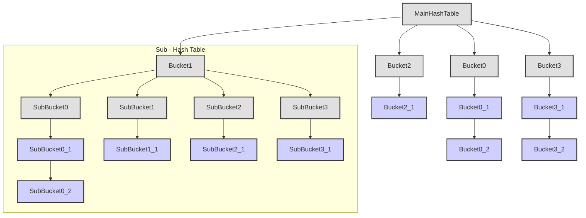
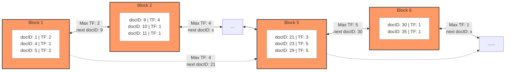

# Inverted Index Documentation

## Part 0: BM25 Introduction
BM25(Best Matching 25)是一种广泛应用于信息检索领域的概率相关性模型，用于衡量查询与文档之间的匹配程度。通常使用场景为根据用户输入的查询内容，检索出与查询内容最相关的top-k文档，BM25为查询和文档的相关性分数计算方式。其核心思想是结合以下几个因素来计算文档的相关性得分：
 - 词频(TF)：词语在文档中出现的次数，反映了词的重要性，但单纯依赖词频可能会使长文档得分偏高。
 - 逆文档频率(IDF)：反映了词语在整个文档集合中的稀有程度，常见词(如“的”、“是”)的IDF较低，而罕见词的IDF较高。
 - 文档长度归一化：通过考虑文档长度及平均文档长度，平衡长文档与短文档之间的影响。
BM25的计算公式通常写作：
$$
\text{idf}(w) = \ln\!\left(\frac{N - n(w) + 0.5}{n(w) + 0.5} + 1\right),\\
\text{score}(d, Q) = \sum_{w \in Q} \text{idf}(w)
\cdot \frac{f(w,d) \, (k_1 + 1)}{f(w,d) + k_1\Bigl(1 - b + b\,\frac{|d|}{\text{avgdl}}\Bigr)}
$$
其中：
 - $Q$为查询词集合。
 - $d$为文档。
 - $f(w,d)$是词𝑤在文档𝑑中的词频。
 - $|d|$是文档$𝑑$的长度，avgdl是所有文档的平均长度。
 - $N$是文档总数，$n(w)$是包含词$w$的文档数。
 - $k_1$和$b$是调节参数，常用值分别约为1.2～2.0和0.75。

这种非线性模型能有效平衡词频和文档长度的影响，在实际搜索引擎中，BM25常被用作排序函数，提供更准确的相关性评估。

实际运用中各种搜索引擎通常根据业务对查询公式进行微调，引入更多参数范围和函数修改，产生出不同BM25算法变种，广泛BM25算法
意指词袋模型下使用词频和词权重进行相关性评分排序的算法，但为避免混淆，我们将索引命名为FULLTEXT索引，而以下文档会使用
"BM25算法簇"表示其广泛含义。

## Part 1: Uasge
#### Index Creation
索引创建语法\
`CREATE INDEX [index_name] ON <table_name> USING FULLTEXT(expr [, expr [, ...]]) [WITH (<options>)];`

其中，expr可以为表中的属性列或者由其构成的表达式，支持text，varchar，char类型以及对应的数组类型。options包括
 - DICTS: 用于指定文本类型数据解析词典，将查询内容或者文档文本转化为分隔开的单词。在多列属性场景下通过"#"对各列单独指定词典，顺序同索引列声明顺序，文本数组属性对应词典会被忽略，使用cn_tokenizer表示系统默认词典。词典的使用和创建请参考tokenizer文档说明。
 - ALGORITHMS: 用于指定文档-查询相似分数计算方式。在多列属性场景下通过"#"对各列单独指定算法。计划支持BM25算法簇及其各种变种，目前可选算法包括"BM25"，"TF-IDF"，"LOG-TF-IDF"，默认使用BM25算法。
 - COEFFICIENTS: 用于指定文档-查询相似分数算法所使用的参数，。设置格式:"<参数>=<数值>"，不同参数通过":"隔开，不允许包含空格，未指定的参数自动使用默认值，在多列属性场景下通过"#"对各列单独指定。目前参数包括"b"(默认值0.75)，"k"(默认值1.2)，只有BM25算法会使用到这些参数。
 - PARALLEL_WORKERS: 索引并行构建线程数量，默认值为0，范围0-64。

通常对于非特殊文本数据不建议设置DICTS参数，而ALGORITHMS和COEFFICIENTS参数只在需要调参优化召回率时调整设置。

用例如下\
`CREATE INDEX ON comments USING FULLTEXT(col1, col2, col3, col4) WITH (DICTS=dict1#dict2#dict3, ALGORITHMS=BM25#BM25#TF_IDF, COEFFICIENTS=b=0.75:k=1.2#b=0.80:k=1.4);`
DDL语句对comments表中的col1, col2, col3, col4属性构建复合索引。col1使用了dict1与BM25算法，参数为0.75和1.2；col2使用了dict2与BM25算法，参数为0.8和1.4；col3使用了dict3与TF-IDF算法，无需参数；col4使用了cn_tokenizer字典与BM25算法，参数为默认参数(b=0.75,k=1.2)。

###### TODO
 - 添加tsvector类型支持。

#### Search
以下查询只能通过FULLTEXT索引执行，关键词包含使用@-@操作符，FULLTEXT评分使用@~@操作符。
###### 查询包含关键词的文档语法
`SELECT * FROM table WHERE document @-@ 'keyword';`
###### 查询包含多个关键词的文档语法
`SELECT * FROM table WHERE document @-@ 'keyword1 AND keyword2 AND keyword3';`
###### 查询包含任何一个关键词的文档语法
`SELECT * FROM table WHERE document @-@ 'keyword1 OR keyword2 OR keyword3';`
###### 复杂查询
`SELECT * FROM table WHERE document @-@ 'keyword1 OR (keyword2 AND keyword3)';`
###### 多列查询
`SELECT * FROM table WHERE document @-@ 'keyword1 OR keyword2' AND title @～@ 'keyword3';`
只支持由AND组合的多种@-@或@~@条件。对于需要表示OR逻辑的查询可以将算子嵌入到查询关键词或者使用常规union等优化实现。

注意关键词可以包含空格，但左右边的空格会被忽略，比如' a b c '等效于'a b c'。目前对于包含空格的关键词查询支持较差，只能尽量维护词典范围内包含空格的关键词集合。另外关键词搜索使用完全匹配，比如包含关键词'数据库'的文档只能通过'数据库'关键词关联，而'数'和'数据'等词不能匹配到'数据库'，如关键词@-@查询未匹配到预期结果可以使用bm25_tokenize(text[, dictionary])函数校验文档分词内容。

###### 索引统计信息
使用函数`select * from index_inspect(<index_name>, [partition_name]);`查询索引的统计信息，比如各部分空间占用，数据损坏，和文档统计信息等。该函数计划同时适配DISKANN和IVF的索引类型。

###### FULLTEXT top-k 查询
`SELECT *, bm25_score() as score FROM table WHERE document @~@ 'some query phrases/sentences' ORDER BY score DESC NULLS LAST LIMIT 10;`\
如果查询语句已经在数据库外部完成分词，可以使用text数组格式查询，用例如下\
`SELECT *, bm25_score() as score FROM table WHERE document @~@ ARRAY['some', 'query', 'phrase', 'sentence'] ORDER BY score DESC NULLS LAST LIMIT 10;`\
建议索引构建属性列和查询使用同样的分词方式以保证FULLTEXT召回的精确性，使用纯文本作为查询检索时会自动匹配索引对应属性所使用的词典。\
增加FULLTEXT评分支持多列查询，该场景下bm25_score()返回的对应分数为各列评分之和，但目前不支持不同权重，用例如下\
`SELECT *, bm25_score() as score FROM table WHERE document @~@ 'some query phrases/sentences' and title @~@ 'another query phrases/sentences' ORDER BY score DESC NULLS LAST LIMIT 10;`\
当然，该查询方式也支持返回非排序结果，用例如下\
`SELECT *, bm25_score() as score FROM table WHERE document @~@ 'some query phrases/sentences' LIMIT 10;`\
注意`bm25_score()`只涉及使用@~@操作符进行相关性计算的分数，如果查询条件中没有使用到@~@操作符以及FULLTEXT索引，则查询会产生报错。

## Part 2: Index Layout
#### Statistics
 - 每个词倒排前记录其IDF值及其对应倒排列表的元信息(倒排列表长度、上界信息)。
 - 文档哈希表保存文档ID->每个文档的具体统计信息和Tid映射，并记录全部的文档统计信息(平均长度，文档数量)

#### Inverted Posting List
##### Techniques
 - 基本结构：存储每个词对应的文档docID及词频，docID从左到右排序。
 - 跳跃指针：在倒排列表中每隔一定文档数插入一个跳跃指针记录区间内最大词频或得分上界，以及跳转目标位置。
 - 压缩存储：采用VB编码或Gamma编码对文档ID差值进行压缩；若文档ID序列较连续，可用RLE对连续区间进行压缩。对词典进行前缀压缩（如FST实现）。
 - 索引重排：对倒排索引下的文档进行排序，使相关性高的文档排名靠前以缩短查询提前停止点，该操作对压缩实现交互，存储格式变动和并发处理的要求高，目前只通过重建索引实现，不进行动态维护。

##### Implementation
###### Containers
 - DiskArray\
 基于磁盘的定长数组，由连续的BlockNumber组成，不可回收，建议由外部复用。
 - DiskHashTable\
 基于DiskArray的不定重哈希表：当某个哈希块挂载长度过长时将挂载列表转化为另一个哈希表。格式如下(install extension `Markdown Preview Mermaid Support` to view it):

 - B-Trie\
 参考[该论文](https://people.eng.unimelb.edu.au/jzobel/fulltext/vldbj09.pdf)实现的一种基于磁盘的B*-Unbalanced-Trie，不使用任何压缩技巧。主要特点在于使用unsigned char作为下标的前缀数组。

###### Index Framework
文档数据内容会被词典分割成单词，倒排索引用于效率地找到单词->文档对应来加速遍历查询单词对应的所有文档。倒排索引可以被分为两大部分：单词索引和倒排列表。

单词索引可以用容器B-Trie或者DiskHashTable实现，理论上前者占用空间小且支持范围查询但查询消耗IO高，后者占用空间大但查询快；实际情况需要根据实现和查询场景具体模拟计算。每个词对应数据包括其词性，单词统计信息，对应倒排列表信息。

每个词都对应一个倒排列表，存储所有包含该词的文档信息。格式如下:

每个Block块存储DocID和TF值，左右连边形成列表，并仿照跳表的形式从左往右跨块连接，目前只设定每隔五块进行连接。连接由BlockNumber和跳跃覆盖范围的最大TF值表示，用于进行查询优化。为优化插入效率，每个词里维护最右块BlockNumber和可能跳表信息以加速插入操作。

正常语料中绝大多数词为低频词，此时使用整页来记录一个单独的低频词对应文档倒排是及其浪费的，我们用DiskVector结构体记录该类数据，格式为定长的倒排列表。
目前列表分为三级，长度分别是4, 32, 162（根据t2ranking,msmarco等数据集词倒排分布，PG页存储容量，查询负载等因素考虑设置），三级之后才会采用整块存储以及对应的跳跃机制。
列表填满后则尝试进行升级，由于涉及到并行问题，每个定长列表使用version属性乐观确定升级一致性。因为升降级间可能会有复杂的并行问题，目前没有降级实现。

整块存储与定长存储共享相同的签名格式，内容如下
```
struct TokenIndexEntry {
    BlockNumber start_blkno;
    BlockNumber insert_blkno;
    TokenStats stats;   /* include only a float as document length */
    TokenIndexEntry() = default;
    TokenIndexEntry(Relation rel, const void *il_meta, uint64 doc_id, uint16 freq, bool need_wal);
    TokenIndexEntry &operator=(const TokenIndexEntry &) = default;
};
```
而倒排列表会将其解析为如下格式
```
class InvertedList {
    ...
    struct long_store {
        BlockNumber start_blkno;
        BlockNumber insert_blkno;
        BlockNumber cur_blkno{InvalidBlockNumber};
        Buffer cur_buf{InvalidBuffer};
        long_store(BlockNumber s, BlockNumber i) : start_blkno(s), insert_blkno(i) {}
    };
    struct short_store {
        uint8 version;
        uint8 level;
        uint32 offset;
        BlockNumber vec_blkno;
        InvertedListEntry *ptr{NULL};
        short_store(BlockNumber s, BlockNumber i, const InvertedListMeta meta);
    };
    Relation _rel;
    bool _is_short;
    bool _need_wal;
    union Store {
        long_store _long;
        short_store _short;
        Store(BlockNumber s, BlockNumber i, const InvertedListMeta meta);
    } _store;
    ...
};
```
由start_blkno标识存储类型，因为建索引前初始化的数据结构已经占用了一定页数，所以start_blkno可以放心表示定长存储级别而不担心冲突，只有数值大于定长级别数量时则被认为是整块存储，表示起始页。insert_blkno包含位置和版本号信息。

###### Vacuum
 - 文档ID为64位自增ID，Vacuum期间直接弃用不可见数据对应ID，不回收已分配数字。
 - 遍历单词索引并行处理倒排列表。列表从开头到结尾归整数据，拿锁顺序与查询相同。规整数据操作简单，无并行问题和重入问题，具体分析请见src/gausskernel/storage/access/bm25/bm25_inverted_list.cpp中函数vacuum()注释。
 - 如果使用B-Trie索引则不考虑索引弃置单词的回收，难度可能很大。

## Part 3: Search
实现代码主要在src/gausskernel/storage/access/bm25/bm25_scan.cpp中。

#### 关键词检索
关键词检索通过QueryGroup树形结构实现逻辑表达式的解析与处理，支持AND/OR逻辑操作符和嵌套表达式。核心流程如下
1. 查询解析
   - 用户查询被解析成QueryGroup树状结构
   - 每个QueryGroup节点包含
     - 逻辑类型（AND/OR）
     - 子节点指针列表（子查询组）
     - 词项集合（叶子节点）
     - 计分需求标志
2. 检索执行
   - 使用next()方法递归遍历查询树
   - AND节点：求所有子节点文档ID的交集
   - OR节点：合并子节点文档ID的并集
3. 优化策略
   - 动态剪枝：当AND组中任一子组无结果时立即终止
   - 位图加速：使用RoaringBitMap高效管理OR组的文档ID集合
   - 位置跳跃：通过no_less_than字段避免重复扫描已知ID范围

#### FULLTEXT top-k 检索优化
采用混合DAAT/TAAT算法实现高效top-k检索，核心优化如下
###### 查询预处理
- 词项权重排序：倒排列表按BM25权重降序排列
- 代价评估：根据查询复杂度选择DAAT或TAAT算法

###### 动态剪枝机制
- 分数上界计算：实时维护当前top-k最小分数阈值
- 跳跃指针：利用倒排列表的nextl_info/next_info长跳/短跳过低分区块

###### 混合检索流程
- 主驱动列表：选择权重最高的倒排列表作为驱动
- 区间扫描：每次处理限定文档ID范围（最多10万条文档，尽快完成首轮或前几轮查询，得到有效的top-k阈值加速后续查询）
- 候选文档评分
  1. 位图过滤（对@-@等其他条件进行判断）
  2. 精确评分
  3. 更新top-k堆

###### 关键优化技术
- 预过滤：结合位图索引快速排除非候选文档
- 惰性求值：仅对候选文档计算精确BM25分数
- 内存控制：临时结果集采用预分配哈希表

###### 关键优化技术
- 正常终止：所有倒排列表遍历完成
- 提前终止：剩余文档的最大可能分数低于当前top-k阈值

#### 性能保障机制
- 中断处理：关键循环插入CHECK_FOR_INTERRUPTS()支持查询取消
- 资源统计：通过QueryStats记录skip/query/load等操作次数
- 错误处理
  - 无效查询类型立即报错
  - 空查询检测：分词后为空立即返回错误

#### 多语言分词集成
- 词典路由：根据列定义的DICT选择分词器
- 后处理：对逻辑表达式分词结果进行二次处理
